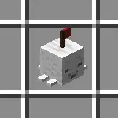
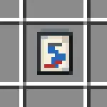
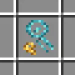
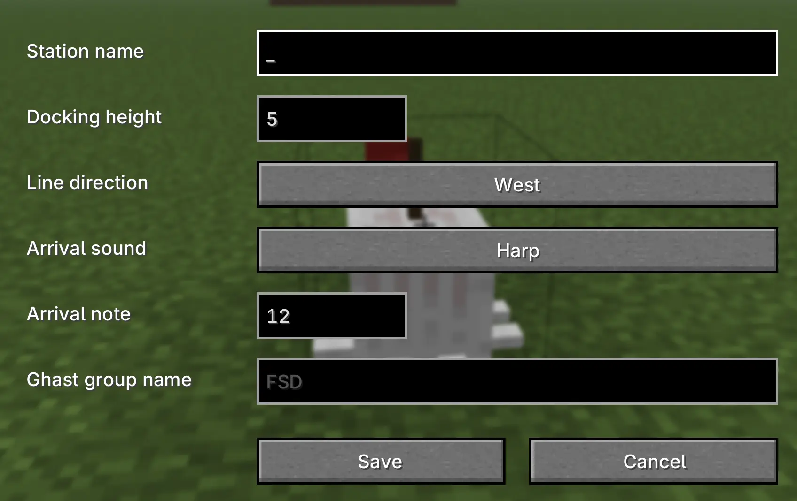
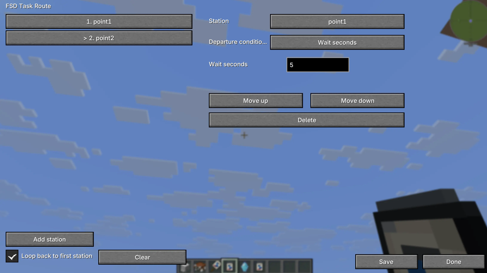

# Happy Ghast: Automation

Happy Ghast: Automation lets Happy Ghasts fly station-to-station routes automatically.
Build Ghast Stations, save a route into an FSD Task, and install the task on a Happy Ghast or a coupled Happy Ghast train.

## What You Can Do

- Create named Ghast Stations as route stops.
- Set each station's docking height, docking direction, and arrival sound.
- Save station routes into FSD Tasks.
- Let Happy Ghasts fly routes automatically.
- Loop a route back to the first station.
- Wait at stations for passengers, time, redstone on, or redstone off.
- Couple up to 6 Happy Ghasts into one train.
- Run one FSD Task across an entire coupled train.
- Use comparators to detect when a Happy Ghast is docked near a station.

## Crafting

Recipes are available in JEI.

The main things to look up are:

- **Ghast Station**: a named stop for FSD routes.

- **FSD Task**: stores a route.

- **FSD Task Remover**: removes an installed task from a Happy Ghast or train.

- **Ghast Coupling Lead**: connects Happy Ghasts together.

## Ghast Stations

Right-click a Ghast Station to open its settings.

You can set:

- **Station name**: the name used by FSD routes.
- **Docking height**: how high Happy Ghasts dock above the station.
- **Line direction**: the direction the lead Happy Ghast faces when docked.
- **Arrival sound** and **arrival note**.

Station names should be unique in the same dimension. If a station is renamed or removed, saved routes using the old name will no longer find it.

When you place a Ghast Station, its default line direction is the direction you are facing. Changing the line direction in the station settings also rotates the station block visually.

For coupled trains, the first Happy Ghast faces the station's line direction and the rest of the train lines up behind it.

## FSD Tasks

Hold an FSD Task and left-click to open the route editor.

In the editor you can:

- Add named Ghast Stations to the route.
- Reorder stops.
- Delete stops.
- Enable or disable looping.
- Choose a departure condition for each stop.

Departure conditions:

- **Wait seconds**: waits for the configured number of seconds.
- **Wait for passengers**: waits until enough players are riding.
- **Wait for redstone on**: waits until the station is powered.
- **Wait for redstone off**: waits until the station is not powered.

After saving a route with at least one station, sneak-right-click a Happy Ghast with the FSD Task to install it.

## Coupled Happy Ghast Trains

Use the Ghast Coupling Lead on two Happy Ghasts to connect them.

1. Right-click the first Happy Ghast with the Ghast Coupling Lead.
2. Right-click the second Happy Ghast with the same lead.
3. The second Happy Ghast is linked behind the first.

Rules:

- A train can have up to 6 Happy Ghasts.
- Coupling cannot form loops.
- Coupled Happy Ghasts lose normal AI and follow the train direction.
- Coupled Happy Ghasts keep a small gap between cars.
- A coupled train can hold only one FSD Task total.
- If you install an FSD Task on any Happy Ghast in a train, the task is managed by the train.

Use shears on a coupled Happy Ghast to cut a coupling.

## Removing FSD Tasks

Right-click a Happy Ghast with the FSD Task Remover to take its installed task back.

For a coupled train, the remover searches the whole train and returns the one installed FSD Task. The task keeps its current focused route action.

## Redstone

Ghast Stations work with comparators and redstone-based route conditions.

- A comparator reads 15 when a Happy Ghast is docked near the station.
- A route stop can wait for the station to receive redstone power.
- A route stop can wait until the station is no longer powered.

This is useful for loading bays, passenger gates, dispatch systems, or station locks.

## Basic Route Setup

1. Place a Ghast Station at each stop.
2. Right-click each station and give it a unique name.
3. Set docking height and line direction if needed.
4. Hold an FSD Task and left-click to open the route editor.
5. Add stations in the order the Happy Ghast should visit them.
6. Choose departure conditions.
7. Save the FSD Task.
8. Sneak-right-click a Happy Ghast, or any Happy Ghast in a coupled train, to install the task.

The Happy Ghast or train will fly to each station, dock facing the station's line direction, wait for the stop condition, and then continue.

## Notes

- Baby Happy Ghasts cannot use FSD Tasks.
- An FSD Task must have at least one route command before it can be installed.
- A coupled train can only have one FSD Task installed.
- If two coupled trains both have FSD Tasks, they cannot be coupled together.
- If a destination is in another dimension, the route will not fly there.
